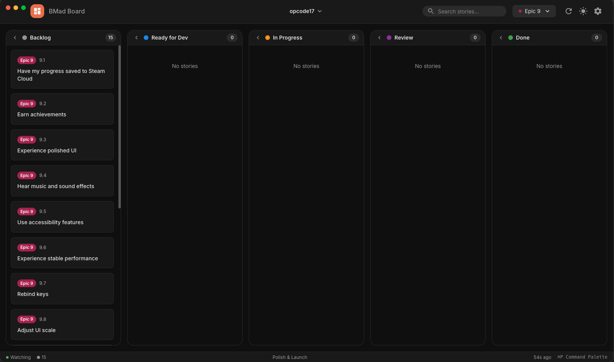

<div align="center">
  
  <p><strong>A desktop sprint board for BMAD methodology projects</strong></p>

    
</div>

---



## Features

- **Kanban Board**: Organize stories across columns (Backlog, Ready for Dev, In Progress, Review, Done)
- **Epic Organization**: Stories grouped by epic with color-coded badges
- **Story Details**: View acceptance criteria, tasks, subtasks, and file changes
- **Search & Filter**: Find stories by text or filter by epic
- **Dark/Light Mode**: Toggle between themes
- **Auto-Refresh**: File watching detects changes to story files
- **Collapsible Columns**: Minimize columns to focus on active work
- **Command Palette**: Quick access to actions with keyboard shortcuts

## Installation

### From Release

Download the latest release for your platform:
- **macOS**: `.dmg` installer
- **Windows**: `.exe` installer
- **Linux**: `.AppImage`

### From Source

```bash
# Clone the repository
git clone https://github.com/yourusername/bmadboard.git
cd bmadboard

# Install dependencies
npm install

# Run in development mode
npm run electron:dev

# Build for production
npm run build
```

## Usage

1. Launch BMad Board
2. Select your BMAD project folder (must contain `docs/epics/` and `docs/stories/`)
3. View your stories organized by status
4. Click a story card to view full details
5. Use `Cmd+K` to open the command palette for quick actions

### Project Structure Requirements

Your BMAD project should have:

```
your-project/
├── docs/
│   ├── epics/
│   │   ├── epic-1.md
│   │   └── epic-2.md
│   └── stories/
│       ├── epic-1/
│       │   ├── 1-1-story-slug.md
│       │   └── 1-2-another-story.md
│       └── epic-2/
│           └── 2-1-story-name.md
```

### Story Status

Stories use frontmatter to define their status:

```yaml
---
status: ready-for-dev
---
```

Valid statuses: `backlog`, `ready-for-dev`, `in-progress`, `review`, `done`, `optional`

## Development

```bash
npm run dev              # Vite dev server only
npm run electron:dev     # Full Electron app in dev mode
npm run build            # Production build
npm run typecheck        # Type checking
```

## Tech Stack

- React 18 + TypeScript
- Electron 33
- MUI (Material UI) 6
- Zustand for state management
- Vite + electron-builder

## License

MIT
